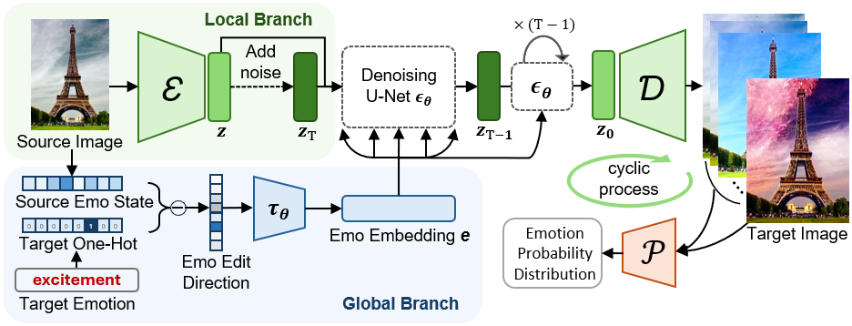

# Make Me Happier: Evoking Emotions Through Image Diffusion Models

## [Paper](https://arxiv.org/pdf/2403.08255.pdf) | [Dataset](https://drive.google.com/drive/folders/1aaZUNo-domsSOH_2_flRU8LMZjptPU28?usp=drive_link) | [Models](https://drive.google.com/drive/folders/1Wkrq5d3JC96PecGJQliz7h5cUmfACpqi?usp=sharing)
PyTorch implementation of EmoEditor, an emotion-evoked diffusion model.  
This work has been accepted to ICCV 2025.

**[Make Me Happier: Evoking Emotions Through Image Diffusion Models](https://arxiv.org/pdf/2403.08255.pdf)**  
Qing Lin, [Jingfeng Zhang](https://zjfheart.github.io/), [Yew-Soon Ong](https://www3.ntu.edu.sg/home/asysong/), [Mengmi Zhang](https://a0091624.wixsite.com/deepneurocognition-1)*  
*Corresponding author  

## Abstract
Despite the rapid progress in image generation, emotional image editing remains under-explored. The semantics, context, and structure of an image can evoke emotional responses, making emotional image editing techniques valuable for various real-world applications, including treatment of psychological disorders, commercialization of products, and artistic design. First, we present a novel challenge of emotion-evoked image generation, aiming to synthesize images that evoke target emotions while retaining the semantics and structures of the original scenes. To address this challenge, we propose a diffusion model capable of effectively understanding and editing source images to convey desired emotions and sentiments. Moreover, due to the lack of emotion editing datasets, we provide a unique dataset consisting of 340,000 pairs of images and their emotion annotations. Furthermore, we conduct human psychophysics experiments and introduce a new evaluation metric to systematically benchmark all the methods. Experimental results demonstrate that our method surpasses all competitive baselines. Our diffusion model is capable of identifying emotional cues from original images, editing images that elicit desired emotions, and meanwhile, preserving the semantic structure of the original images.

<div align=left></div>  
<!-- The generated images evoke a sense of happiness in viewers, contrasting with the negative emotions elicited by the source images. Given a source image that triggers negative emotions (framed in green), our method (Ours) synthesizes a new image that elicits the given positive target emotions (in red), while maintaining the essential elements and structures of the scene. For instance, our method replaces the anger-inducing flames in the source image with cute-shaped lamps to evoke the target emotion of amusement. While in an outdoor setting, the raging fire is substituted with a tranquil, lush meadow to inspire a sense of awe. For comparisons, we include other competitive methods. The blue number below each image represents its CAM-based ESMI score, with higher values being better.  -->


## EmoPair Dataset
<div align=left></div>  
<!-- The dataset comprises two subsets: EmoPair-Annotated Subset (EPAS, left blue box) and EmoPair-Generated Subset (EPGS, right orange box). Each subset includes schematics depicting the creation, selection, and labeling of image pairs in the upper quadrants, with two example pairs in the lower quadrants. Each example pair comprises a source image (framed in green) and a target image. The classified source and target emotion labels (highlighted in red) and target-emotion-driven text instructions for image editing are provided. -->

* Download our [EPGS dataset](https://drive.google.com/drive/folders/10jwTjzVpTLTOe8HnzgLBgtyFvYPMlybb?usp=drive_link) and put it in `EmoPair/EPGS/`.
* Download [Ip2p images](https://instruct-pix2pix.eecs.berkeley.edu/clip-filtered-dataset/) and put them in `EmoPair/EPAS/ip2p_clip/`.
* Download dataset annotation [data_EmoPair.json](https://drive.google.com/file/d/1aEHnfqVPwtey6zv3cRnmQvbtWhF5c5Z-/view?usp=drive_link) and put it in `json/`.

## EmoEditor Model
<div align=left></div>  
EmoEditor is an image diffusion model with local (shaded in green) and global (shaded in blue) branches. The pre-trained VAE’s encoder E and decoder D are fixed during training and inference. Exclusively employed during inference, the fixed emotion predictor P predicts emotions on generated images for iterative emotion inference.

## Environment Setup
```
conda create -n emoeditor python=3.10
conda activate emoeditor 

pip install torch torchvision torchaudio
pip install diffusers
pip install accelerate
pip install transformers==4.49
pip install opencv-python
pip install scikit-image
pip install grad-cam
```

## Training & Testing
For training,
* Set up the environment.
* Download our pretrained [emotion predictor](https://drive.google.com/file/d/1LWcj-ENbgqefXjuz2aVB8ynzUpnQYnim/view?usp=drive_link) and put it in `emo_predictor/`.
* Follow the instructions to download the EmoPair Dataset.

You can start training the model from scratch by running:
```
python train.py
```

For testing,
* Download our [models](https://drive.google.com/drive/folders/1qwTDU51XMXCa6Pjw9wNyZEUgr6ZxqjMl?usp=drive_link) and put them in `model/`.
* Replace the `input_path` in `test.py` with the path to your test image.
* Adjust `random_seed`, `target_emo`, and other `ArgumentParser` options as needed.

You can test the model by running:
```
python test.py
```

## Human Psychophysics Experiments on Amazon Mechanical Turk
We have conducted a series of Mechanical Turk experiments using the [Psiturk](https://psiturk.org/) platform, which requires JavaScript, HTML, and Python 2.7.
<div align=left></div>
Results from Human Psychophysics Experiments. The proportions of images that human participants prefer our EmoEditor over all other methods on the x-axis are presented. Chance is 50% (red dotted line). Error bars are standard errors. 
Data from all participants in our human psychophysics experiments are available at the [link](https://drive.google.com/file/d/1m-N02qJ8E0jA8KmMbKzqVSWH8lpYV5V9/view?usp=drive_link).

## Emotional Structure Matching Index (ESMI)
$ESMI = \alpha \times S_{str} + (1 - \alpha) \times S_{emo}$
* $𝑆_{𝑒𝑚𝑜}$ (Emotional Evocation): KLD measuring shift toward target emotion.
* $𝑆_{𝑠𝑡𝑟}$ (Structural Preservation): Ensures edits focus on emotion regions ($𝑅_{𝑒𝑚𝑜}$​) and preserve neutral ($𝑅_{𝑛𝑒𝑢}​$). $𝑅_{𝑒𝑚𝑜}$ from Grad-CAM or human annotations.

## Visualization
<div align=left></div>
Visualisation of Generated Images from Different Methods. The target emotion is highlighted in red, and the source image is framed in green. The blue number below each image is its CAM-based ESMI score, with higher values being better.

## Generalization to Real-world Scenarios
<div align=left></div>
Our EmoEditor can generalize to more challenging emotion editing scenarios. Source images are framed in green. Target emotions are in red.
(a) Same-Valence Editing highlights our EmoEditor’s ability to produce images evoking emotions of the same positive valence as the source images. 
(b) Neutral-Valence Editing demonstrates how our EmoEditor can transform neutral real-world images to evoke positive or negative emotions. 
(c) Multi-Emotion Editing demonstrates its capability to generate images that evoke a wider range of emotions, providing more nuanced and diverse visual outputs. 


## BibTeX
```
@article{lin2024emoeditor,
  title={Make Me Happier: Evoking Emotions Through Image Diffusion Models},
  author={Qing Lin and Jingfeng Zhang and Yew Soon Ong and Mengmi Zhang},
  journal={arXiv preprint arXiv:2403.08255},
  year={2024}
}
```


## Acknowledgments
We benefit a lot from [CompVis/stable_diffusion](https://github.com/CompVis/stable-diffusion), [timothybrooks/instruct-pix2pix](https://github.com/timothybrooks/instruct-pix2pix/tree/main?tab=readme-ov-file) and [ayaanzhaque/instruct-nerf2nerf](https://github.com/ayaanzhaque/instruct-nerf2nerf) repo.
