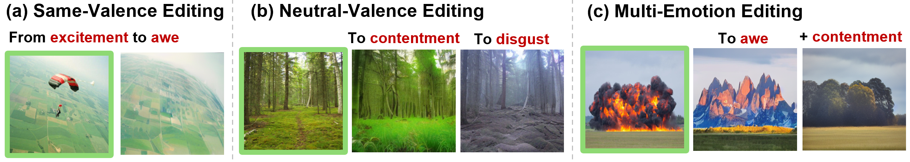
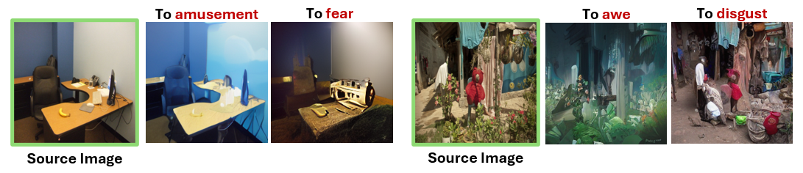
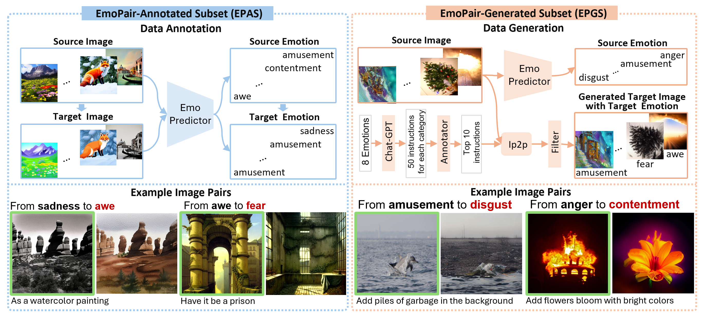
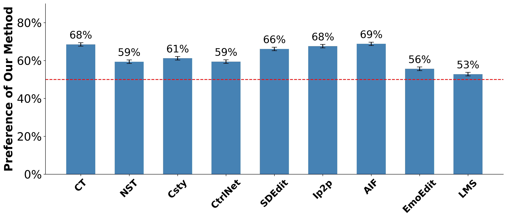

# Make Me Happier: Evoking Emotions Through Image Diffusion Models

## [Demo]() | [Paper](https://arxiv.org/pdf/2403.08255.pdf) | [Data]()
PyTorch implementation of EmoEditor, an emotion-evoked diffusion model.  
Code and data will be released upon paper acceptance.

**[Make Me Happier: Evoking Emotions Through Image Diffusion Models](https://arxiv.org/pdf/2403.08255.pdf)**  
Qing Lin, [Jingfeng Zhang](https://zjfheart.github.io/), [Yew Soon Ong](https://www3.ntu.edu.sg/home/asysong/), [Mengmi Zhang](https://a0091624.wixsite.com/deepneurocognition-1)*  
*Corresponding author  

## Abstract
Despite the rapid progress in image generation, emotional image editing remains under-explored. The semantics, context, and structure of an image can evoke emotional responses, making emotional image editing techniques valuable for various real-world applications, including treatment of psychological disorders, commercialization of products, and artistic design. For the first time, we present a novel challenge of emotion-evoked image generation, aiming to synthesize images that evoke target emotions while retaining the semantics and structures of the original scenes. To address this challenge, we propose a diffusion model capable of effectively understanding and editing source images to convey desired emotions and sentiments. Moreover, due to the lack of emotion editing datasets, we provide a unique dataset consisting of 340,000 pairs of images and their emotion annotations. Furthermore, we conduct human psychophysics experiments and introduce four new evaluation metrics to systematically benchmark all the methods. Experimental results demonstrate that our method surpasses all competitive baselines. Our diffusion model is capable of identifying emotional cues from original images, editing images that elicit desired emotions, and meanwhile, preserving the semantic structure of the original images.

<div align=left></div>  
The generated images evoke a sense of happiness in viewers, contrasting with the negative emotions elicited by the source images. Given a source image that triggers negative emotions (framed in green), our method (Ours) synthesizes a new image that elicits the given positive target emotions (in red), while maintaining the essential elements and structures of the scene.

## Results in Cross-Valence Scenarios 
<div align=left></div>  

## Results in Same-Valence Scenarios 
<div align=left></div>

## Results in Neutral-Valence Scenarios 
<div align=left></div>

## EmoPair Dataset
<div align=left></div>  
The dataset comprises two subsets: EmoPair-Annotated Subset (EPAS, left blue box) and EmoPair-Generated Subset (EPGS, right orange box). Each subset includes schematics depicting the creation, selection, and labeling of image pairs in the upper quadrants, with two example pairs in the lower quadrants. Each example pair comprises a source image (framed in green) and a target image. The classified source and target emotion labels (highlighted in red) and target-emotion-driven text instructions for image editing are provided.

## Benchmark
**human psychophysics experiments and four newly introduced metrics**  
Compare with five state-of-the-art methods: (1) [Color-transfer(CT)](https://www.sciencedirect.com/science/article/abs/pii/S1077314206002189); (2) [Neural-Style-Transfer(NST)](https://arxiv.org/abs/1508.06576); (3) [CLIP-Styler(Csty)](https://openaccess.thecvf.com/content/CVPR2022/html/Kwon_CLIPstyler_Image_Style_Transfer_With_a_Single_Text_Condition_CVPR_2022_paper.html); (4) [Ip2p](https://openaccess.thecvf.com/content/CVPR2023/html/Brooks_InstructPix2Pix_Learning_To_Follow_Image_Editing_Instructions_CVPR_2023_paper.html); (5) Large Model Series (LMS). This includes [BLIP](https://proceedings.mlr.press/v162/li22n.html) for image captioning, followed by [GPT-3](https://proceedings.neurips.cc/paper/2020/hash/1457c0d6bfcb4967418bfb8ac142f64a-Abstract.html) for text instruction generation, and [Ip2p](https://openaccess.thecvf.com/content/CVPR2023/html/Brooks_InstructPix2Pix_Learning_To_Follow_Image_Editing_Instructions_CVPR_2023_paper.html) for image editing based on the instructions.

<div align=left></div>  
The Human Psychophysics Experiment Results. The average proportion of images that human participants prefer our EmoEditor over other competitive methods is 56%. Chance is 50% in the red dotted line.  

| **Method** | **EMR(%)↑** | **ESR(%)↑** | **ENRD↓** | **ESS↓** |
|:---|:---:|:---:|:---:|:---:|
| **CT** | 6.89 | 79.32 | 32.61 | **7.36** |
| **NST** | 34.42 | 92.01 | 34.42 | 18.57 |
| **Csty** | 11.51 | 85.52 | 41.59 | 36.64 |
| **Ip2p** | 2.53 | 67.76 | **9.82** | <ins>12.71</ins> |
| **LMS** | 11.51 | 77.38 | 26.67 | 19.74 |
| **w/o $\mathcal{P}$** | 5.06 | 69.15 | <ins>20.08</ins> | 14.93 |
| **w/o $L_{emb}$** | <ins>41.12</ins> | <ins>92.36</ins> | 23.02 | 16.06 |
| **Ours** | **50.20** | **92.86** | 24.73 | 16.27 |
  
**Emotion Matching Ratio (EMR) and Emotion Similarity Ratio (ESR) assess the extent to which the generated images evoke target emotions.**  
**EMR**: We use the emotion predictor $\mathcal{P}$ to predict the emotional category of generated images and calculate the proportion of alignment with the target emotions.  
**ESR**: Our emotion predictor $\mathcal{P}$ produces emotion probability distributions $e_g$ on generated images and $e_s$ on source images. We introduce Kullback-Leibler Divergence distance $KLD(\cdot)$ and calculate ESR as the proportion of the generated images, where $KLD(e_g, e_{oh}) < KLD(e_s, e_{oh})$. $e_{oh}$ is the binary one-hot target emotion vector. It indicates the effect of edits introduced on the generated images in transitioning from the source emotion to the target emotion.  
**Emotion-Neutral Region Deviation (ENRD) and Edge Structure Similarity (ESS) measure the structural coherence and semantic consistency between source and generated images.**  
**ENRD**: We first identify emotionally neutral regions on the source images by employing the Grad-CAM \cite{selvaraju2017gradcam} technique through our emotion predictor $\mathcal{P}$. We then binarize the Grad-CAM maps with a threshold of 0.5, where a value of 1 on the resulting binary map signifies regions triggering emotions. By excluding these regions, we compute pixel-level L1 distance between emotionally neutral regions of the source and generated images.  
**ESS**: We apply the Canny edge detection algorithm on both source and generated images using thresholds of 200 and 500. Next, we compute the L1 norm between these edge maps to quantify their structural differences.  

## BibTeX
```
@article{lin2024emoeditor,
  title={Make Me Happier: Evoking Emotions Through Image Diffusion Models},
  author={Qing Lin and Jingfeng Zhang and Yew Soon Ong and Mengmi Zhang},
  journal={arXiv preprint arXiv:2403.08255},
  year={2024}
}
```


## Acknowledgments
We benefit a lot from [CompVis/stable_diffusion](https://github.com/CompVis/stable-diffusion), [timothybrooks/instruct-pix2pix](https://github.com/timothybrooks/instruct-pix2pix/tree/main?tab=readme-ov-file) and [ayaanzhaque/instruct-nerf2nerf](https://github.com/ayaanzhaque/instruct-nerf2nerf) repo.
